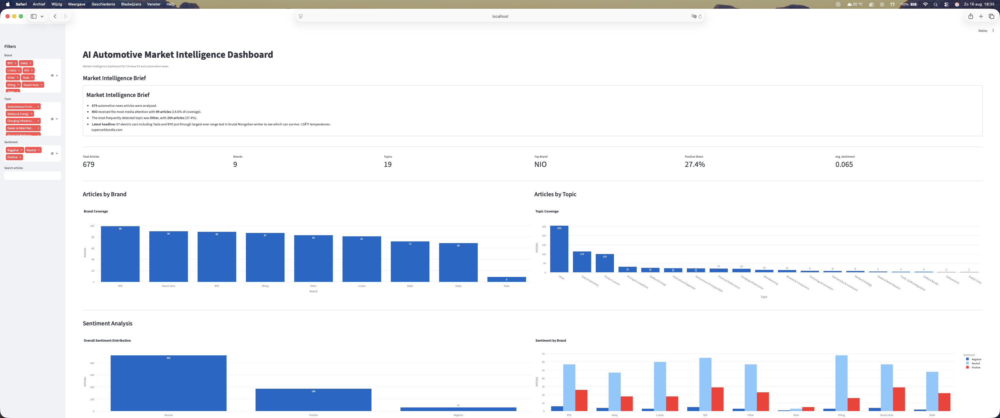

# AI Automotive Market Intelligence Agent

An end-to-end market intelligence pipeline that automatically collects, processes, classifies and analyses automotive news related to Chinese electric vehicle manufacturers. The project transforms raw news articles into actionable business insights through an interactive Streamlit dashboard.

---

## Project Overview

This project demonstrates how data analytics, business intelligence and natural language processing can be combined to monitor developments within the automotive industry.

The pipeline automatically:

- Collects automotive news
- Cleans and preprocesses text data
- Classifies articles by company
- Classifies articles by business topic
- Performs sentiment analysis
- Generates an executive market summary
- Visualises insights in an interactive dashboard

The primary focus is Chinese EV manufacturers and their competitive landscape.

---

## Focus Companies

- BYD
- Geely
- Zeekr
- NIO
- XPeng
- Li Auto
- Xiaomi Auto
- Tesla

---

# Pipeline

```
RSS News Sources
        │
        ▼
News Collection
        │
        ▼
Data Cleaning
        │
        ▼
Brand Classification
        │
        ▼
Topic Classification
        │
        ▼
Sentiment Analysis
        │
        ▼
Executive Market Brief
        │
        ▼
Interactive Dashboard
```

---

# Dashboard Features

## Executive Market Brief

Automatically generates a concise market summary including:

- Total articles analysed
- Most covered company
- Most discussed topic
- Latest industry headline

---

## Interactive Filters

Users can filter articles by:

- Brand
- Topic
- Sentiment
- Search keyword

---

## KPI Dashboard

Key business metrics include:

- Total articles
- Number of companies
- Number of topics
- Top brand
- Positive sentiment share
- Average sentiment score

---

## Business Intelligence Visualisations

Interactive charts include:

- Articles by brand
- Articles by topic
- Overall sentiment distribution
- Sentiment by brand

---

## News Database

Searchable article database including:

- Source
- Title
- Brand
- Topic
- Sentiment
- Publication date
- Original article link

---

# Topic Classification

Articles are automatically classified into business topics including:

- Battery & Energy
- Charging Infrastructure
- Product Launch
- Sales & Deliveries
- Financial Performance
- International Expansion
- Manufacturing
- Autonomous Driving & ADAS
- Partnerships & Investment
- Trade, Tariffs & Regulation
- Supply Chain
- Safety & Recalls
- Software & Connectivity

---

# Technologies Used

- Python
- Pandas
- Streamlit
- Plotly
- TextBlob
- Feedparser
- Git
- GitHub

---

# Project Structure

```
AI-Automotive-Market-Intelligence-Agent/

├── app/
├── data/
│   ├── raw/
│   └── processed/
├── notebooks/
├── screenshots/
├── src/
│   ├── collectors/
│   ├── processing/
│   ├── analysis/
│   ├── dashboard/
│   └── utils/
├── requirements.txt
└── README.md
```

---

# Example Workflow

1. Collect automotive news from RSS feeds
2. Clean and preprocess articles
3. Detect mentioned automotive brands
4. Classify business topics
5. Analyse article sentiment
6. Generate market intelligence summary
7. Display insights in the interactive dashboard

---

# Example Dashboard

*(Add dashboard screenshots here)*

### Dashboard Overview



### Market Intelligence Brief


### Sentiment Analysis


### Article Database


---

# Future Improvements

Potential future extensions include:

- Machine learning-based topic classification
- Named Entity Recognition (NER)
- Trend detection over time
- Company comparison dashboards
- Interactive geographic analysis
- Automated PDF reporting
- LLM-powered market commentary

---

# Purpose

This project was developed as part of a personal portfolio focused on Business Intelligence, Market Intelligence and Data Analytics within the automotive industry.

The objective is to demonstrate practical skills in:

- Data collection
- Data preprocessing
- Business intelligence
- Natural language processing
- Dashboard development
- Data visualisation
- Python programming