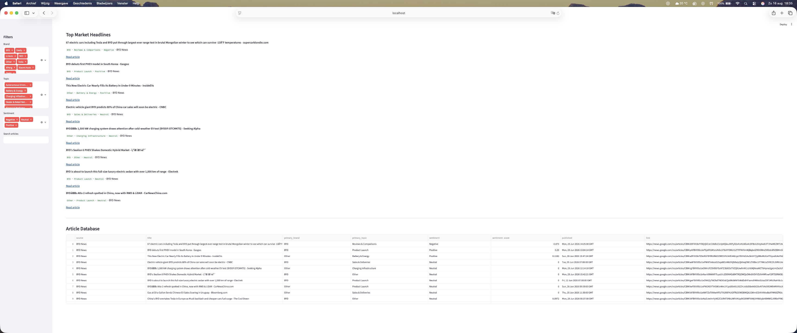
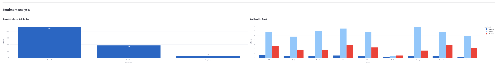
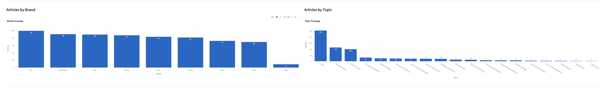

# AI Automotive Market Intelligence Agent


An end-to-end market intelligence platform that automatically collects, processes, classifies and analyses automotive news related to Chinese electric vehicle manufacturers. The project transforms raw news articles into actionable business insights through an interactive Streamlit dashboard.

---

# Project Overview

This project demonstrates how Business Intelligence, Data Analytics and Natural Language Processing can be combined to monitor developments across the Chinese electric vehicle industry.

The pipeline automatically:

- Collects automotive news from RSS feeds
- Cleans and preprocesses article text
- Detects mentioned automotive brands
- Classifies articles into business topics
- Performs sentiment analysis
- Generates an executive market intelligence brief
- Visualises insights through an interactive dashboard

The primary focus is monitoring Chinese EV manufacturers and analysing their competitive landscape.

---

# Quick Start

```bash
git clone https://github.com/oliveraidev/AI-Automotive-Market-Intelligence-Agent.git
cd AI-Automotive-Market-Intelligence-Agent
pip install -r requirements.txt
streamlit run src/dashboard/app.py
```

---

# Focus Companies

- BYD
- Geely
- Zeekr
- NIO
- XPeng
- Li Auto
- Xiaomi Auto
- Tesla

---

# Architecture

```text
RSS News Sources
        │
        ▼
News Collection
        │
        ▼
Data Cleaning
        │
        ▼
Brand Classification
        │
        ▼
Topic Classification
        │
        ▼
Sentiment Analysis
        │
        ▼
Executive Market Brief
        │
        ▼
Interactive Streamlit Dashboard
```

---

# Dashboard Features

## Executive Market Brief

Automatically generates a concise market summary including:

- Total articles analysed
- Most covered company
- Most discussed topic
- Latest industry headline

---

## Interactive Filters

Users can filter articles by:

- Brand
- Topic
- Sentiment
- Keyword search

---

## KPI Dashboard

Business metrics include:

- Total articles analysed
- Companies monitored
- Topics identified
- Top brand coverage
- Positive sentiment share
- Average sentiment score

---

## Business Intelligence Visualisations

Interactive charts include:

- Articles by Brand
- Articles by Topic
- Overall Sentiment Distribution
- Sentiment by Brand

---

## News Database

Searchable article database containing:

- Source
- Title
- Brand
- Topic
- Sentiment
- Publication date
- Original article URL

---

# Topic Classification

Articles are automatically categorised into business topics including:

- Battery & Energy
- Charging Infrastructure
- Product Launch
- Sales & Deliveries
- Financial Performance
- International Expansion
- Manufacturing
- Autonomous Driving & ADAS
- Partnerships & Investment
- Trade, Tariffs & Regulation
- Supply Chain
- Safety & Recalls
- Software & AI
- Pricing & Competition
- Dealer & Retail Network
- Technology & Innovation

---

# Technologies

- Python
- Pandas
- Streamlit
- Plotly
- TextBlob
- Feedparser
- Git
- GitHub

---

# Project Structure

```text
AI-Automotive-Market-Intelligence-Agent/

├── data/
│   ├── raw/
│   └── processed/
├── screenshots/
├── src/
│   ├── collectors/
│   ├── processing/
│   ├── analysis/
│   ├── dashboard/
│   └── utils/
├── requirements.txt
├── README.md
└── .gitignore
```

---

# Workflow

1. Collect automotive news from RSS feeds.
2. Clean and preprocess article data.
3. Detect automotive brands.
4. Classify business topics.
5. Perform sentiment analysis.
6. Generate an executive market intelligence brief.
7. Display results in an interactive dashboard.

---

# Dashboard

## Dashboard Overview


---

## KPI Dashboard



---

## Sentiment Analysis



---

## Articles Database



---

# Future Improvements

Potential future extensions include:

- Transformer-based topic classification
- Named Entity Recognition (NER)
- Trend analysis over time
- Company benchmarking dashboards
- Geographic market visualisations
- Automated PDF reporting
- LLM-generated market commentary
- Real-time news ingestion

---

# Purpose

This project was developed as part of my personal Business Intelligence, Market Intelligence and Data Analytics portfolio.

It demonstrates practical experience with:

- Data Collection
- Data Cleaning
- Natural Language Processing
- Sentiment Analysis
- Business Intelligence
- Dashboard Development
- Data Visualisation
- Python Programming
